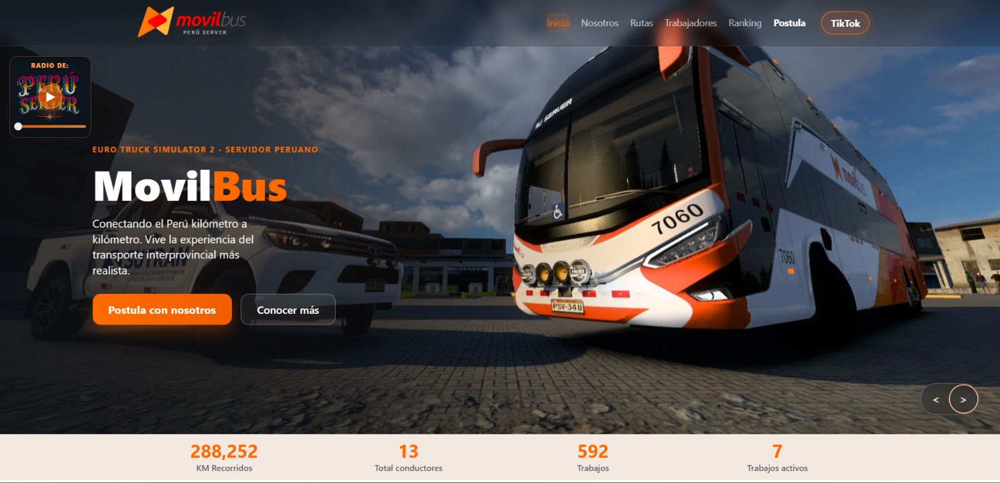

# MovilBus Web



Sitio web oficial de **MovilBus**, servidor peruano de **Euro Truck Simulator 2**, desarrollado en HTML, CSS y JavaScript puro (sin frameworks).

## Descripción

La web presenta una experiencia premium y minimalista para mostrar:
- Información del servidor.
- Rutas activas en Perú.
- Equipo de conductores.
- Ranking mensual e histórico por kilómetros.
- Formulario oficial de postulación.

Todo el contenido principal se carga en una sola página (`index.html`) con secciones modulares.

## Funcionalidades principales

- Hero principal con CTA de postulación y navegación por anclas.
- Navbar fija con estado activo por sección (scroll/hash).
- Menú móvil con botón hamburguesa.
- Sección Nosotros con tarjetas informativas.
- Mapa de Perú con marcadores de rutas activas.
- Lista de viajes como botones con modal de detalle.
- Equipo de conductores con modal por perfil e historial.
- Ranking Top 5 del mes y Top 5 histórico con avatar.
- Integración de Google Forms embebido + botón externo.
- Footer personalizado con navegación interna y TikTok.
- Diseño responsive y animaciones suaves.

## Lógica de datos (Trucky API)

La app consume datos de la compañía **41407** en Trucky.

- Base API: `https://e.truckyapp.com/`
- Integrantes: `/members`
- Trabajos (paginado): `/jobs`
- Rutas activas

### Reglas implementadas

- Para rutas activas se usa la **última ruta en curso por conductor**.
- Filtro de ventana: **últimas 72 horas**.
- Solo se consideran trabajos `in_progress` no completados.
- El contador de "Trabajos activos" en el hero refleja ese resultado.
- Si la API falla, entra modo fallback con `mock` interno.

## Secciones de la web

- `#inicio`: portada + métricas globales.
- `#nosotros`: propuesta del servidor y experiencia.
- `#rutas`: mapa + listado de rutas activas + modal de viaje.
- `#trabajadores`: cards de conductores + modal con estadísticas.
- `#ranking`: top mensual e histórico.
- `#postula`: formulario oficial de Google Forms.

## Tecnologías

- HTML5
- CSS3 (modular)
- JavaScript Vanilla (módulos globales por archivo)
- Fetch API

## Estructura del proyecto

```text
movilbus-web/
├── index.html
├── rutas.html
├── trabajadores.html
├── ranking.html
├── postula.html
├── assets/
│   ├── github/
│   │   └── Home.jpeg
│   └── img/
│       ├── logo.png
│       ├── mapa-peru.png
│       ├── Mobil.jpeg
│       ├── default-avatar.svg
│       └── icons/
│           └── icon.webp
├── css/
│   ├── variables.css
│   ├── layout.css
│   ├── components.css
│   ├── animations.css
│   └── styles.css
├── js/
│   ├── utils.js
│   ├── api.js
│   ├── rutas.js
│   ├── trabajadores.js
│   ├── ranking.js
│   ├── form.js
│   └── main.js
└── services/
    └── truckyService.js
```

## Cómo ejecutar en local

Necesitas un servidor local (no abrir con `file://`), porque se cargan secciones HTML por `fetch`.

### Opción 1: VS Code Live Server
1. Abrir carpeta del proyecto en VS Code.
2. Click derecho en `index.html`.
3. Seleccionar **Open with Live Server**.

### Opción 2: Python
```bash
python -m http.server 5500
```
Luego abrir:
`http://127.0.0.1:5500/`

## Configuración rápida

### Cambiar compañía Trucky
Editar en [`js/api.js`](js/api.js):
- `API_BASE`

### Cambiar ventana de rutas activas
Editar en [`js/rutas.js`](js/rutas.js):
- `LAST_ROUTE_WINDOW_HOURS`

### Cambiar enlace de postulación
Editar en [`postula.html`](postula.html):
- `href` del botón
- `src` del iframe

### Cambiar TikTok del footer
Editar en [`js/main.js`](js/main.js) dentro de `renderSiteFrame()`.

## Responsive

La web está optimizada para móvil, tablet y escritorio con breakpoints principales en:
- `1200px`
- `990px`
- `860px`
- `680px`
- `480px`

Incluye ajustes de:
- Tipografía y spacing.
- Hero adaptable.
- Grids de rutas/conductores/ranking.
- Modal en pantallas pequeñas.
- Navegación móvil desplegable.

## Créditos

- Proyecto: **MovilBus**
- Desarrollo: **NILVER T.I**
- Integración de datos: **Trucky API**
